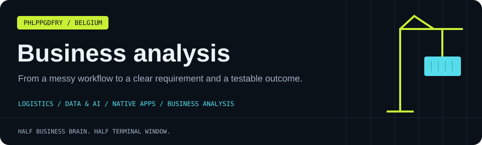

[← Main profile](README.md) · [Apps](INDIE_DEV.md) · [Business analysis](BA_PROFILE.md) · [Professional](PROFESSIONAL.md) · [Personal](PERSONAL.md) · [All projects](PROJECTS.md)

## From “we need a dashboard” to a useful decision 🧠

I combine business analysis with hands-on development. I like understanding the workflow, identifying the decision that needs support, and turning it into requirements that can be implemented and checked.

My portfolio connects **processes, data, user journeys and working software**. The examples below are portfolio projects and case studies; their proposed improvements are study outcomes, not claims of measured client results.

## Selected case studies

| Case | Business question | What to inspect |
| :--- | :--- | :--- |
| [Breakfast delivery](https://github.com/phlppgdfry/breakfast-delivery-platform) | How should ordering, recommendations and fulfilment fit together? | BRD, user stories, SQL and KPI definitions |
| [Customer churn](https://github.com/phlppgdfry/customer-churn-analysis) | Where does retention break down, and what should be prioritised? | Root-cause analysis, cohorts and a retention roadmap |
| [GymLabb specification](https://github.com/phlppgdfry/gymlabb-platform-spec) | What does a coaching platform need across its user roles? | Epics, stories, feature priorities and platform design |
| [Workwear ERP lab](https://github.com/phlppgdfry/workwear-erp-lab) | How should a webshop hand off orders to Business Central? | Integration boundaries, ERP workflow and an AL extension |
| [Port optimisation](https://github.com/phlppgdfry/port-logistics-optimization) | Where can a terminal process reduce waiting and handoffs? | Archived AS-IS / TO-BE case study and illustrative business case |

## Analysis that reaches the implementation

### 🚢 PortOps AI: make exceptions explainable

An operational question — **“Which vehicles need attention today, and why?”** — becomes explicit readiness rules, evidence sources, user roles and a review workflow.

The prototype demonstrates separate pickup/loading readiness, conflicting or stale records, draft actions and approval. Synthetic scenarios keep the assumptions visible.

[Project](https://github.com/phlppgdfry/portops-ai) · [Product vision](https://github.com/phlppgdfry/portops-ai/blob/main/docs/product-vision.md)

### 📱 DocuRelay: treat offline work as part of the process

A field worker needs to capture evidence even when connectivity disappears. That requirement leads to a durable local queue, visible status, retries and a backend processing flow.

[Project](https://github.com/phlppgdfry/docurelay-field) · [Portfolio walkthrough](https://github.com/phlppgdfry/docurelay-field/blob/main/docs/portfolio-walkthrough.md)

### 📊 Analytics: start with the question

Sales analysis, sensor telemetry and logistics KPIs offer different settings for the same discipline: define the measure, understand the data quality, and give the reader a useful next step.

[Sales analytics](https://github.com/phlppgdfry/python-data-analytics-project) · [Sensor platform](https://github.com/phlppgdfry/environmental-sensor-data-platform) · [Logistics portfolio](https://github.com/phlppgdfry/Logistics-Master)

## How I structure an engagement

| Step | Output | Question it answers |
| :--- | :--- | :--- |
| Discover | Stakeholder map, problem statement, scope | Whose problem are we solving? |
| Map | AS-IS process, handoffs, constraints | What happens today? |
| Analyse | Gaps, root causes, data and KPI definitions | Where is the friction, and how do we know? |
| Specify | TO-BE process, stories, acceptance criteria | What should change? |
| Prioritise | MoSCoW, dependencies, risks and trade-offs | What should happen first? |
| Validate | UAT scenarios and traceability | How will we know it works? |

## Example acceptance criterion

> **Given** a field worker has no connectivity, **when** they add a document, **then** the document remains in a durable local queue and the interface shows that it is waiting to sync.

That sentence can be reviewed by a stakeholder, implemented by a developer and exercised by a tester. This is the level of connection I aim for.

## Methods and tools

**Requirements:** BRDs, functional specifications, user stories, acceptance criteria, use cases. 
**Processes:** BPMN, AS-IS / TO-BE, gap analysis, root-cause analysis, stakeholder mapping. 
**Decisions:** MoSCoW, business cases, risks, dependencies and UAT planning. 
**Data:** SQL, Python, pandas, Excel, Power Query, Power BI and KPI definitions. 
**Collaboration:** Jira, Confluence, Miro, Figma and version-controlled documentation.

## Working together

Interested in business analysis, a technical BA role, product discovery or an operational workflow that needs clearer requirements? I bring commercial experience and the ability to explore the implementation directly.

**Languages:** Dutch (native), French (fluent), English (professional).

---

**[Website](https://philippegodfroy.com) · [LinkedIn](https://linkedin.com/in/philippe-godfroy) · [Email](mailto:philippe.godfroy@hotmail.com)**

