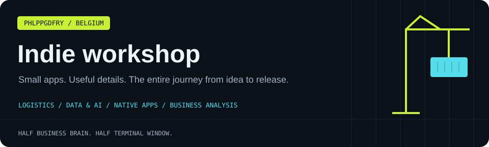

[← Main profile](README.md) · [Apps](INDIE_DEV.md) · [Business analysis](BA_PROFILE.md) · [Professional](PROFESSIONAL.md) · [Personal](PERSONAL.md) · [All projects](PROJECTS.md)

## Small apps, surprisingly many decisions 🍎

I'm Philippe, a self-taught developer based on the Belgian coast. I enjoy taking a focused idea through the whole product journey: interface, implementation, testing, packaging, documentation and distribution.

The interesting part is often the last ten percent: the keyboard shortcut that feels right, the permissions screen that makes sense, the download that works, or the setting a user can actually find.

## The apps

### 🖱 ClickTrack — understand your Mac activity

A local productivity dashboard for clicks, keystroke counts, scrolls, focus sessions and daily patterns. The app counts activity without recording the text you type.

| Product detail | What to explore |
| :--- | :--- |
| Platform | Native macOS utility |
| Experience | Menu-bar access, daily and weekly views, focus rhythm and milestones |
| Data | Activity stays on the Mac; no account is required |
| Distribution | Direct macOS download through GitHub Releases |
| Current release distinction | The public v1.0.2 is the notarized legacy Pro build; the newer license-key flow is a separate workstream |

**[Project and release notes](https://github.com/phlppgdfry/ClickTrack) · [Downloads](https://github.com/phlppgdfry/ClickTrack/releases) · [Website](https://clicktrackapp.com)**

### 🪞 MirrorMate — a mirror, one shortcut away

A native camera mirror for the Mac, accessible from the menu bar or a keyboard shortcut. Built around a floating window, camera controls and a small, purposeful interface.

| Product detail | What to explore |
| :--- | :--- |
| Platform | macOS; SwiftUI and AppKit |
| Camera | AVFoundation, freeze frame, zoom and capture controls |
| Interaction | Global shortcut, floating panel and keyboard controls |
| Product layer | StoreKit 2 and configurable Pro features |
| Repository | Public product showcase; app source is private |

**[Showcase](https://github.com/phlppgdfry/MirrorMate-App) · [App Store](https://apps.apple.com/us/app/mirrormate-menubar-mirror/id6752225278) · [Website](https://mirrormateapp.com)**

## The experimental shelf

| Project | Idea | Scope |
| :--- | :--- | :--- |
| [LocalMind](https://github.com/phlppgdfry/LocalMind) | A local AI chat dashboard powered by Ollama | Experiment |
| [Git Personality Profiler](https://github.com/phlppgdfry/git-personality-profiler) | Turn commit history into a playful developer identity | Python tool |
| [Health Intake Pipeline](https://github.com/phlppgdfry/health-intake-pipeline) | Explore consent, image-quality checks and review gates in SwiftUI | Case-study app |
| [GymLabb](https://github.com/phlppgdfry/gymlabb-platform-spec) | Coaching workflows, roles, stories and product priorities | Public product specification |

## My product loop

1. **Find the friction.** What is someone trying to do, and what gets in the way?
2. **Make the core interaction work.** One clear task before a page of settings.
3. **Handle reality.** Permissions, interrupted work, unavailable services and confusing states.
4. **Package the experience.** Screenshots, release notes, installation and support information.
5. **Improve with evidence.** Use feedback and observed problems to choose the next change.

 

> The smallest app still comes with a surprisingly large number of decisions.

## Tools I reach for

**Apple:** Swift, SwiftUI, AppKit, AVFoundation, StoreKit, Xcode. 
**Web and prototypes:** TypeScript, React, Next.js, Python, APIs. 
**Data and delivery:** SQLite, Supabase, GitHub Actions and release documentation.

[Full toolbox](TOOLBOX.md) · [Professional engineering portfolio](PROFESSIONAL.md)

## Compare notes

I'd enjoy talking about useful Mac apps, native interfaces, local-first tools, or the practical work of taking a small product from prototype to release.

---

**[Website](https://philippegodfroy.com) · [LinkedIn](https://linkedin.com/in/philippe-godfroy) · [Email](mailto:philippe.godfroy@hotmail.com)**

