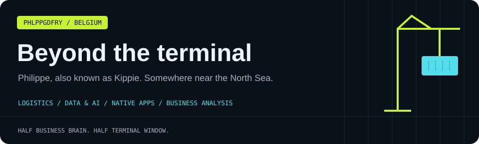

[← Main profile](README.md) · [Apps](INDIE_DEV.md) · [Business analysis](BA_PROFILE.md) · [Professional](PROFESSIONAL.md) · [Personal](PERSONAL.md) · [All projects](PROJECTS.md)

## Hey, I'm Philippe. Or Kippie. 👋

Originally from **Bruges**, now based in **Knokke-Heist** on the Belgian coast. I like building things, understanding how they work, and occasionally remembering that there is an entire world outside a terminal window.

This is where the golf, kitesurfing and chess live.

## The coast 🌊

Bruges means canals, old streets and architecture. Knokke-Heist means dunes, wind and the North Sea. I have a particular appreciation for the off-season: quieter beaches, more space and a very different pace.

```text
origin       Bruges / West Flanders
home base    Knokke-Heist / Belgian coast
background   North Sea
open tabs    probably too many
```

## Golf ⛳

I enjoy the combination of technique, course management and the mental game. There is always something to improve, and one good shot can persuade you to forgive a remarkable amount of nonsense.

The long-term ambition: keep getting better. Preferably with fewer arguments with the short game.

## Kitesurfing 🪁

When the wind and conditions line up, the North Sea is an excellent reason to close the laptop. Wind and water require attention in a way that makes the backlog feel pleasantly irrelevant.

> The only dashboard that matters for a moment is the wind forecast.

## Chess ♟️

Online and occasionally over the board. I like positional play, building structures and thinking a few moves ahead — with regular reminders that the other person also gets a turn.

Blitz is a particularly efficient way to discover that a plan looked better twenty seconds ago.


## How my brain tends to work

| Trigger | Likely response |
| :--- | :--- |
| “I wonder how that works” | Open the docs, try a small example |
| A repetitive task | Consider whether a script would help |
| A vague product idea | Sketch the first useful interaction |
| A bug that makes no sense | Keep looking until the cause does |
| Good wind | Reconsider the afternoon plan |

## Things I return to

A few interests from the reading and watching shelf:

- **Thinking, Fast and Slow** — decisions, biases and how people reason.
- **Zero to One** — thinking about new products and businesses.
- **The Almanack of Naval Ravikant** — work, learning and independence.
- **Paul Graham's essays** — building, startups and thinking clearly.
- **3Blue1Brown** — visual explanations of mathematics.
- **Andrej Karpathy's lectures** — understanding the foundations behind AI tools.
- **Long-form conversations**, including the Lex Fridman podcast.

## Languages

| Language | Level |
| :--- | :--- |
| Dutch | Native |
| French | Fluent |
| English | Professional |

## Say hi

Golf, the coast, chess, building small apps or an interesting idea: happy to talk. For the work side, head to the [professional profile](PROFESSIONAL.md).

---

**[Website](https://philippegodfroy.com) · [LinkedIn](https://linkedin.com/in/philippe-godfroy) · [Email](mailto:philippe.godfroy@hotmail.com)**


