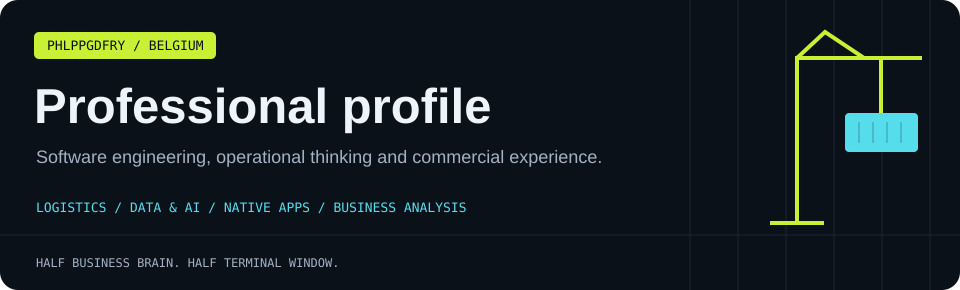
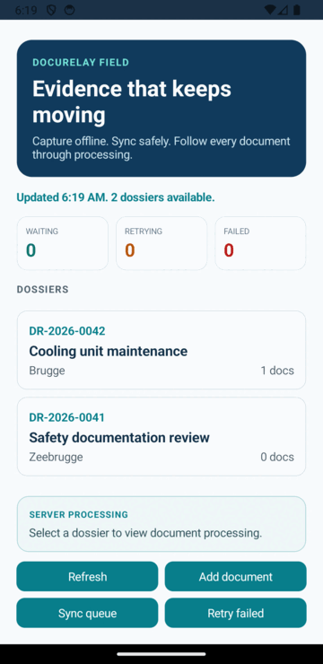

[← Main profile](README.md) · [Apps](INDIE_DEV.md) · [Business analysis](BA_PROFILE.md) · [Professional](PROFESSIONAL.md) · [Personal](PERSONAL.md) · [All projects](PROJECTS.md)

## Software, operations and business context 🛠

I'm **Philippe Godfroy**, a self-taught developer and entrepreneur based in **Knokke-Heist, Belgium**, originally from Bruges. I've been learning and building independently since around 2010.

My work spans native applications, APIs, data pipelines, operational dashboards and business analysis. I enjoy connecting the business question to the implementation, including the less glamorous details: state, permissions, failure handling, documentation and release work.

## Choose a technical walkthrough

| Project | Demonstrates | Current scope |
| :--- | :--- | :--- |
| [PortOps AI](https://github.com/phlppgdfry/portops-ai) | Domain rules, scoped agent tools, evidence and human approval | Local .NET prototype; production integration planned |
| [DocuRelay Field](https://github.com/phlppgdfry/docurelay-field) | MAUI, SQLite persistence, API contracts, upload retries and processing | Portfolio app with verified Android emulator workflow |
| [Shipment Tracking](https://github.com/phlppgdfry/shipment-tracking-platform) | .NET, Clean Architecture, CQRS and logistics visibility | Portfolio platform |
| [Business Central operations](https://github.com/phlppgdfry/business-central-agentic-operations) | AI-assisted order workflow, approval and audit trail | Portfolio project |
| [Sensor Data Platform](https://github.com/phlppgdfry/environmental-sensor-data-platform) | Python provisioning, IoT telemetry, analytics and reporting | Data engineering portfolio |
| [Fabric Data Platform](https://github.com/phlppgdfry/fabric-lottery-data-platform) | Medallion architecture, data modelling and a staged Fabric build | Early learning scaffold |
| [MirrorMate](https://github.com/phlppgdfry/MirrorMate-App) | Native Mac interaction, camera integration and product delivery | App showcase; private source |
| [ClickTrack](https://github.com/phlppgdfry/ClickTrack) | Local activity analytics and macOS distribution | Downloadable app |

## Watch a real workflow

<table>
<tr>
<td width="38%" align="center" valign="top">

</td>
<td valign="top">

### DocuRelay Field

A recorded Android emulator demonstration from the project repository.

**Inspect the engineering:**

- Durable SQLite state and upload queue.
- API consumption through typed contracts.
- Retry handling and visible document status.
- Local outbox and worker processing.
- Automated tests and Android packaging workflow.

[Runtime evidence](https://github.com/phlppgdfry/docurelay-field/blob/main/docs/runtime-validation.md) · [Architecture](https://github.com/phlppgdfry/docurelay-field/blob/main/docs/architecture.md)

</td>
</tr>
</table>

## Technical toolkit in context

| Area | Technologies and practices |
| :--- | :--- |
| Backend & mobile | C#, ASP.NET Core, .NET MAUI, REST, SQLite, explicit domain rules |
| Apple platforms | Swift, SwiftUI, AppKit, AVFoundation, StoreKit and Xcode |
| Web | TypeScript, JavaScript, React, Next.js and Tailwind CSS |
| Data | Python, SQL, pandas, NumPy, PostgreSQL and Plotly |
| Cloud & delivery | Azure, Bicep, Docker, GitHub Actions and Vercel |
| AI workflows | Local models, retrieval, bounded tools, evaluation and review steps |
| Business analysis | Process models, requirements, KPI design, prioritisation and acceptance criteria |

**[Detailed toolbox](TOOLBOX.md)** · **[Business analysis examples](BA_PROFILE.md)**

## Experience

The commercial and operational side of my work matters alongside the code.

| Period | Role | Experience |
| :--- | :--- | :--- |
| 2020 onward | Independent IT / product development | Software projects, product decisions, implementation and delivery |
| 2019–2020 | Account Manager · Huswell BV | Client relationships, service coordination and escalation handling |
| Around 2018 | Stock Controller · Louis Vuitton | Inventory, reconciliation, reporting and structured operations |
| 2015–2018 | Founder & Lead Technician · PhilPhone VoF | Device repair, customer service and running a small business |
| Since around 2010 | Self-directed technical learning | Software development, product work and business analysis |

## How I work

- Start by understanding the workflow and the decision it supports.
- Make scope, assumptions and incomplete areas visible.
- Build a working slice and exercise meaningful failure cases.
- Keep documentation close to the code and the evidence.
- Communicate in terms that fit the person reviewing the work.

## Collaboration

I'm interested in **development, technical business analysis, data and operational software**, including roles that connect these areas. Also happy to discuss focused freelance work or product collaboration.

**Based in:** Knokke-Heist, Belgium. 
**Languages:** Dutch (native), French (fluent), English (professional).

---

**[Website](https://philippegodfroy.com) · [LinkedIn](https://linkedin.com/in/philippe-godfroy) · [Email](mailto:philippe.godfroy@hotmail.com)**

