<p align="center">
  
</p>

<p align="center">
  <a href="https://philippegodfroy.com"></a>
  <a href="https://linkedin.com/in/philippe-godfroy"></a>
  <a href="mailto:philippe.godfroy@hotmail.com"></a>
</p>

<p align="center">
<a href="https://github.com/phlppgdfry/ClickTrack/releases"></a>
<a href="https://phlppgdfry.github.io/terminal-operating-system-sim/"></a>
<a href="assets/docurelay-demo.gif"></a>
</p>

<p align="center"><b><a href="#explore-the-harbor">Harbor map</a> · <a href="#featured-projects">Featured projects</a> · <a href="#project-arcade">Project arcade</a> · <a href="#side-quest-of-the-month">Side quest</a> · <a href="#dispatch-log">Activity</a> · <a href="#off-duty">Off duty</a></b></p>

## Hi, I'm Philippe 👋

A self-taught builder from **Bruges → Knokke-Heist, Belgium**. I like turning vague things into working things: a port operations desk, an offline mobile workflow, a tiny Mac utility, a data pipeline, or a business case with an actual next step.

**Half business brain, half terminal window.** I enjoy the space where software meets operations: understanding the problem, shaping the workflow, building a useful first version, and finding out what breaks.

```yaml
philippe:
  home_base: Belgian coast
  building_since: "~2010"
  interests: [logistics, data, AI, native apps, business analysis]
  default_mode: "understand → prototype → test → improve"
  side_quests: enabled
  scope_creep: investigating
```

## Start here

| If you're here for… | Take this route |
| :--- | :--- |
| 🍎 Apps, product decisions and indie development | [The indie workshop](INDIE_DEV.md) |
| 🧠 Requirements, processes and business cases | [Business analysis portfolio](BA_PROFILE.md) |
| 🛠 Engineering, experience and collaboration | [Professional profile](PROFESSIONAL.md) |
| 🌊 The human behind the repositories | [Off-duty Philippe](PERSONAL.md) |
| 🗂 Everything I've put on the public shelf | [Full project catalog](PROJECTS.md) |

## Explore the harbor

Four districts, one slightly overcommitted builder. **Click a district to enter.**

<a href="INDIE_DEV.md">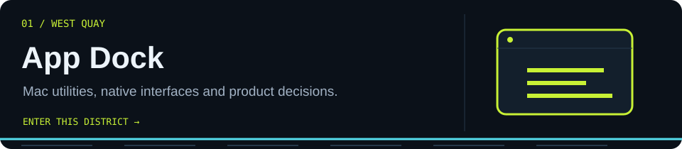</a>
<a href="PROJECTS.md#data-engineering--analytics">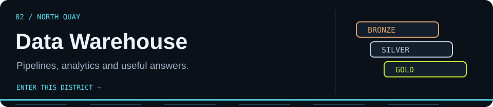</a>
<a href="PROJECTS.md#ai-developer-tools--learning">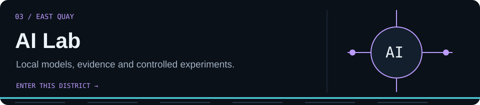</a>
<a href="PROJECTS.md#ports-logistics--operations">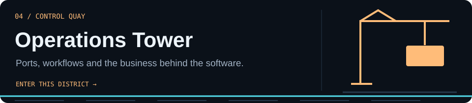</a>

[App Dock](INDIE_DEV.md) · [Data Warehouse](PROJECTS.md#data-engineering--analytics) · [AI Lab](PROJECTS.md#ai-developer-tools--learning) · [Operations Tower](PROJECTS.md#ports-logistics--operations)

## Featured projects

Six projects, each with a different job to do. Open the screenshots and build notes for a closer look.

### 🚢 Logistics Master

<a href="https://github.com/phlppgdfry/Logistics-Master">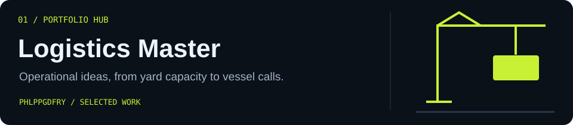</a>

A central hub for terminal simulations, yard capacity, shipment visibility, empty-mileage tools and operational intelligence.

**Portfolio hub · Prototypes and research.** [Explore the hub →](https://github.com/phlppgdfry/Logistics-Master)


### 🧭 PortOps AI

<a href="https://github.com/phlppgdfry/portops-ai">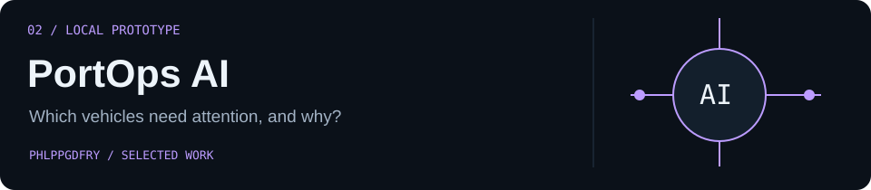</a>

Investigate RoRo readiness, conflicting evidence and booking exceptions. Prepare an action draft for human review.

**Working local prototype · C# / .NET.** [Explore the prototype →](https://github.com/phlppgdfry/portops-ai)

<details>
<summary><b>Behind the build: an answer needs a source</b></summary>

**Problem:** an operational record can look complete while pickup readiness, loading readiness and the latest observations disagree.

**Design choice:** separate readiness rules, keep source IDs and timestamps visible, and make proposed actions reviewable. A confident sentence should never erase conflicting evidence.

**Next iteration:** real-model validation, production identity and integration. The current implementation uses synthetic scenarios and simulated delivery.

[Read the project decisions](https://github.com/phlppgdfry/portops-ai/blob/main/docs/architecture.md)

</details>

### 🖱 ClickTrack

<a href="https://github.com/phlppgdfry/ClickTrack">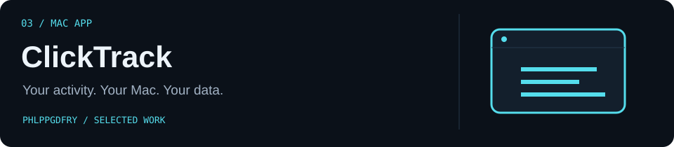</a>

Local analytics for clicks, keystroke counts, scrolls and focus rhythm. Data stays on your Mac.

**macOS app · Direct download.** [Downloads →](https://github.com/phlppgdfry/ClickTrack/releases) · [Project →](https://github.com/phlppgdfry/ClickTrack)

<details>
<summary><b>View the real product screenshot</b></summary>


</details>

<details>
<summary><b>Behind the build: the release is its own product</b></summary>

**Problem:** source code and the version a user downloads can move at different speeds.

**Design choice:** make the public notarized v1.0.2 legacy Pro build distinguishable from the newer license-key workstream.

**Next iteration:** a fresh signed and notarized archive for the license-key flow before it replaces the public download. Packaging belongs on the roadmap alongside features.

[Read the release notes](https://github.com/phlppgdfry/ClickTrack/releases/tag/v1.0.2)

</details>

### 🪞 MirrorMate

<a href="https://github.com/phlppgdfry/MirrorMate-App">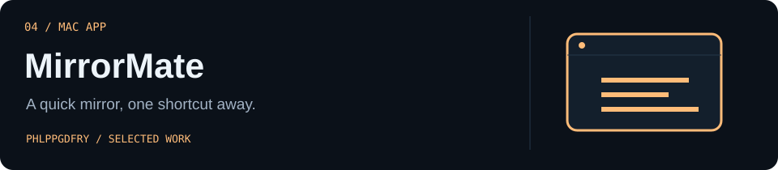</a>

A floating Mac camera mirror with keyboard shortcuts and appearance controls.

**macOS app · SwiftUI / AVFoundation.** [App Store →](https://apps.apple.com/us/app/mirrormate-menubar-mirror/id6752225278) · [Showcase →](https://github.com/phlppgdfry/MirrorMate-App)

<details>
<summary><b>View the real product screenshot</b></summary>


</details>


### 🏗 Fabric Data Platform

<a href="https://github.com/phlppgdfry/fabric-lottery-data-platform">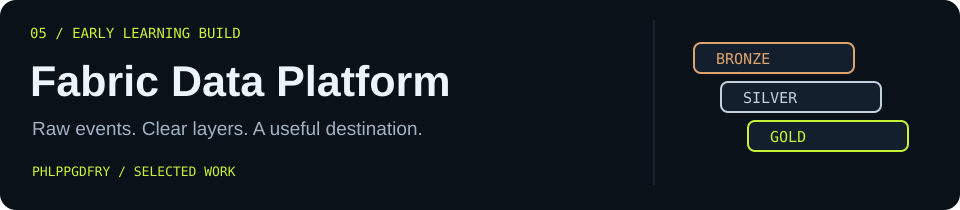</a>

A staged Microsoft Fabric learning build: synthetic events, Bronze/Silver/Gold layers, PySpark, SQL and dbt.

**Early scaffold · Data engineering learning lab.** [Architecture and build plan →](https://github.com/phlppgdfry/fabric-lottery-data-platform)


### 📱 DocuRelay Field

<a href="https://github.com/phlppgdfry/docurelay-field">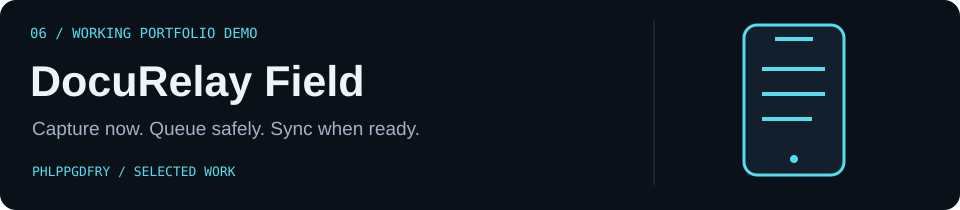</a>

Capture evidence offline, keep it in a durable SQLite queue, then sync to an ASP.NET Core processing workflow.

**Working portfolio demo · .NET MAUI / SQLite.** [Project →](https://github.com/phlppgdfry/docurelay-field) · [Existing walkthrough →](assets/docurelay-demo.gif)

<details>
<summary><b>View the real product screenshot</b></summary>

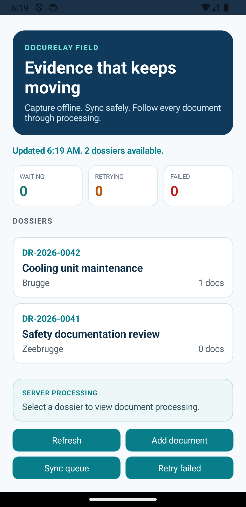

</details>

<details>
<summary><b>Behind the build: offline is a workflow, not an error message</b></summary>

**Problem:** a field worker must be able to retain evidence when connectivity disappears.

**Design choice:** durable SQLite state, an explicit upload queue and visible retry/processing status. Android runtime testing also exposed a query translation issue that needed a real fix.

**Next iteration:** physical-device checks and iOS validation. The recorded Android emulator flow is the evidence for the current milestone.

[Read the runtime evidence](https://github.com/phlppgdfry/docurelay-field/blob/main/docs/runtime-validation.md)

</details>

## On the workbench 🔧

| Focus | What I'm exploring |
| :--- | :--- |
| [PortOps AI](https://github.com/phlppgdfry/portops-ai) | Operational evidence, bounded agent tools and approval workflows |
| [Fabric Data Platform](https://github.com/phlppgdfry/fabric-lottery-data-platform) | Data modelling, Medallion architecture and a staged engineering build |
| [DocuRelay Field](https://github.com/phlppgdfry/docurelay-field) | Offline mobile state, reliable processing and Azure architecture |

<p align="center">
  
  
</p>

## Project arcade

Pick a lane. There are operational tools, native apps, enterprise workflows and a few ideas that escaped the notebook.

| Lane | Good places to start |
| :--- | :--- |
| 🚢 **Ports & logistics** | [Logistics Master](https://github.com/phlppgdfry/Logistics-Master) · [PortOps AI](https://github.com/phlppgdfry/portops-ai) · [PortPulse](https://github.com/phlppgdfry/portpulse) · [TOS simulator](https://github.com/phlppgdfry/terminal-operating-system-sim) |
| 📊 **Data engineering & analytics** | [Fabric platform](https://github.com/phlppgdfry/fabric-lottery-data-platform) · [Sensor data platform](https://github.com/phlppgdfry/environmental-sensor-data-platform) · [Belgium mobility/weather ETL](https://github.com/phlppgdfry/belgium-mobility-weather-etl) · [Sales analytics](https://github.com/phlppgdfry/python-data-analytics-project) |
| 🏢 **Enterprise & .NET** | [Shipment tracking](https://github.com/phlppgdfry/shipment-tracking-platform) · [Business Central operations](https://github.com/phlppgdfry/business-central-agentic-operations) · [DocuRelay](https://github.com/phlppgdfry/docurelay-field) · [Workwear ERP lab](https://github.com/phlppgdfry/workwear-erp-lab) |
| 🍎 **Apps & utilities** | [ClickTrack](https://github.com/phlppgdfry/ClickTrack) · [MirrorMate](https://github.com/phlppgdfry/MirrorMate-App) · [Health intake case study](https://github.com/phlppgdfry/health-intake-pipeline) |
| 🤖 **AI & developer experiments** | [LocalMind](https://github.com/phlppgdfry/LocalMind) · [Foundry lab](https://github.com/phlppgdfry/micro-foundry-lab) · [Git Personality Profiler](https://github.com/phlppgdfry/git-personality-profiler) · [Stack rules](https://github.com/phlppgdfry/stack-rules) |
| 🧠 **Business analysis** | [Breakfast delivery](https://github.com/phlppgdfry/breakfast-delivery-platform) · [Customer churn](https://github.com/phlppgdfry/customer-churn-analysis) · [GymLabb specification](https://github.com/phlppgdfry/gymlabb-platform-spec) |

**[Browse the complete catalog, including labs and archived work →](PROJECTS.md)**

## The toolbox

<p>


</p>

| Work | Tools in context |
| :--- | :--- |
| Native apps | SwiftUI, AVFoundation and StoreKit in [MirrorMate](https://github.com/phlppgdfry/MirrorMate-App) |
| APIs & mobile workflows | ASP.NET Core, MAUI and SQLite in [DocuRelay](https://github.com/phlppgdfry/docurelay-field) |
| Data & reporting | Python, pandas, SQL and Plotly in [Sales Analytics](https://github.com/phlppgdfry/python-data-analytics-project) |
| Operational interfaces | TypeScript dashboards and KPI design in [PortPulse](https://github.com/phlppgdfry/portpulse) |
| Business analysis | Process maps, requirements, user stories and prioritisation in [the BA portfolio](BA_PROFILE.md) |

<details>
<summary><b>More tools, frameworks and things I've experimented with</b></summary>

Web: Next.js, Tailwind CSS, Angular, Node.js, FastAPI, REST APIs and webhooks.

Data: PostgreSQL, Supabase, Firebase, NumPy, Jupyter, Power BI, Excel and Power Query.

AI: Ollama, retrieval, tool calling, model APIs, evaluation and scraping workflows.

Delivery: GitHub Actions, Docker, Vercel, Bicep, Xcode and TestFlight.

Product: BPMN, BRDs, acceptance criteria, MoSCoW, Figma, Jira, Confluence and Miro.

**[Open the full badge wall →](TOOLBOX.md)** · These are tools used or explored; repositories show their actual scope.

</details>

## How I build

**Understand the operation → define the smallest useful workflow → build it → exercise the awkward cases → improve it.**

I'm interested in the details that make a tool usable: what happens offline, where an answer came from, who approves an action, what a KPI actually means, and what a user should do when something fails.

<p align="center"></p>
<p align="center"><sub>Shipping software: now with a literal shipping department.</sub></p>

## Side quest of the month

**September 2026 · Git Personality Profiler 🧬**

What happens when commit history gets a cyberpunk identity crisis? A Python tool that explores commit patterns, vocabulary and playful developer archetypes.


**Try this:** run it against one of your own repositories and inspect the report. The archetypes are entertainment, not a scientific personality assessment.

```bash
git clone https://github.com/phlppgdfry/git-personality-profiler.git
cd git-personality-profiler
python3 profiler.py /path/to/your/repository
```

[Explore the side quest →](https://github.com/phlppgdfry/git-personality-profiler) · [Installation notes →](https://github.com/phlppgdfry/git-personality-profiler#-installation)

## Things I learned the hard way

- **An ORM expression still has to become valid SQL.** DocuRelay's enum `ToString()` translation needed to become a query parameter.
- **A feature in source is not a feature in the download.** ClickTrack's release status must follow the actual distributed artifact.
- **“Ready” needs a definition.** PortOps separates pickup readiness, loading readiness and conflicting observations.
- **A demo needs an honest data story.** The Fabric build starts with explicitly synthetic events and a visible implementation plan.

[Read the engineering notes and their evidence →](BUILD_NOTES.md)

## Museum of questionable decisions

<details>
<summary><b>🐛 Exhibit 01 — “Surely SQLite speaks ToString.”</b></summary>

It did not. A DocuRelay query translated an enum conversion into a SQLite function that did not exist. The fix passed the enum value as a parameter, followed by a fresh Android runtime check.

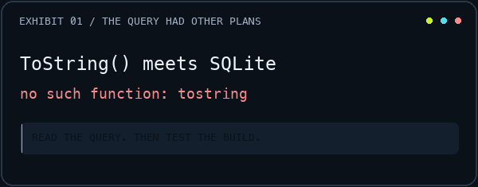

**Souvenir:** inspect the generated query before questioning reality.

[The documented bug and validation](https://github.com/phlppgdfry/docurelay-field/blob/main/docs/runtime-validation.md)

</details>

<details>
<summary><b>📦 Exhibit 02 — “It works in the source code.”</b></summary>

A useful sentence for developers. Less useful to the person downloading a ZIP. ClickTrack's public release and newer license-key implementation need distinct status labels until the new archive is ready.

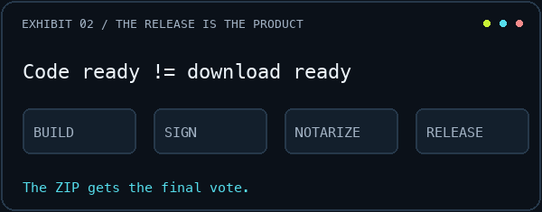

**Souvenir:** the ZIP gets the final vote.

[The release notes](https://github.com/phlppgdfry/ClickTrack/releases/tag/v1.0.2)

</details>

<details>
<summary><b>🧭 Exhibit 03 — “Let's just add one ready flag.”</b></summary>

Pickup-ready and loading-ready are different questions. Add stale observations and conflicting records, and a single green badge starts doing a suspicious amount of work.

**Souvenir:** a small Boolean can conceal a large business process.

[The PortOps readiness model](https://github.com/phlppgdfry/portops-ai)

</details>

<sub>Playful captions around documented engineering issues and design trade-offs. Animations are illustrations, not recordings.</sub>

## Milestones

A few concrete checkpoints from the public build log:

- **7 June 2026:** ClickTrack v1.0.2 published as the notarized legacy Pro download. [Release](https://github.com/phlppgdfry/ClickTrack/releases/tag/v1.0.2)
- **28–29 July 2026:** DocuRelay Android emulator workflow documented, then rechecked after the SQLite fix. [Runtime evidence](https://github.com/phlppgdfry/docurelay-field/blob/main/docs/runtime-validation.md)
- **8 September 2026:** PortOps gains procedure retrieval and durable, human-reviewed action proposals. [Commit](https://github.com/phlppgdfry/portops-ai/commit/e622656fdd6baf717e5a5c986f9c73382e2f8058)

[Open the milestone log →](MILESTONES.md)

## Dispatch log

<!-- ACTIVITY:START -->


**Try the featured work:** [ClickTrack](https://github.com/phlppgdfry/ClickTrack/releases) · [MirrorMate](https://apps.apple.com/us/app/mirrormate-menubar-mirror/id6752225278) · [Terminal Operations Simulator](https://phlppgdfry.github.io/terminal-operating-system-sim/) · [DocuRelay Android walkthrough](https://github.com/phlppgdfry/docurelay-field/blob/main/docs/assets/android-runtime-postfix-demo.gif)

**Recently pushed repositories**

| Repository | Latest push (UTC) |
| :--- | :--- |
| [portops-ai](https://github.com/phlppgdfry/portops-ai) | 2026-09-08 |
| [fabric-lottery-data-platform](https://github.com/phlppgdfry/fabric-lottery-data-platform) | 2026-09-04 |
| [shipment-tracking-platform](https://github.com/phlppgdfry/shipment-tracking-platform) | 2026-09-04 |
| [business-central-agentic-operations](https://github.com/phlppgdfry/business-central-agentic-operations) | 2026-09-04 |
| [Logistics-Master](https://github.com/phlppgdfry/Logistics-Master) | 2026-08-27 |

**Latest stable releases from the featured release watchlist**

- [ClickTrack · v1.0.2](https://github.com/phlppgdfry/ClickTrack/releases/tag/v1.0.2) — 2026-06-07

<sub>Snapshot: 2026-09-09 UTC · Public, owned, non-fork repositories; profile repository excluded. Release watchlist: ClickTrack, MirrorMate, DocuRelay, PortOps, Logistics Master and Shipment Tracking.</sub>
<!-- ACTIVITY:END -->

<sub>Generated from public GitHub data. Repository activity reflects code pushes; releases link to their original notes.</sub>

## Off duty

**Golf, kitesurfing, chess, and a healthy respect for the North Sea wind forecast.** Originally from Bruges, now based in Knokke-Heist. Dutch, French and English.

<p align="center"><br><sub>Meanwhile, the wind forecast has opened another tab.</sub></p>

<details>
<summary><b>Bonus: the unofficial operating manual</b></summary>

```text
A small idea       → a note
An interesting bug → a late evening
A messy workflow   → a prototype
A windy day        → check the forecast
One more feature   → famous last words
```

[More about the person behind the code →](PERSONAL.md)

</details>

## Let's build something useful

Interested in **operational software, data products, native apps or turning a business problem into a working prototype**? I'd enjoy comparing notes.

**[Website](https://philippegodfroy.com) · [LinkedIn](https://linkedin.com/in/philippe-godfroy) · [Email](mailto:philippe.godfroy@hotmail.com)**

<p align="center"></p>
<p align="center"><sub>Built on the Belgian coast. Usually with a terminal open.<br>Profile exploration inspired by <a href="https://github.com/HariSekhon">Hari Sekhon</a>; harbor artwork and animations made for this profile.</sub></p>
