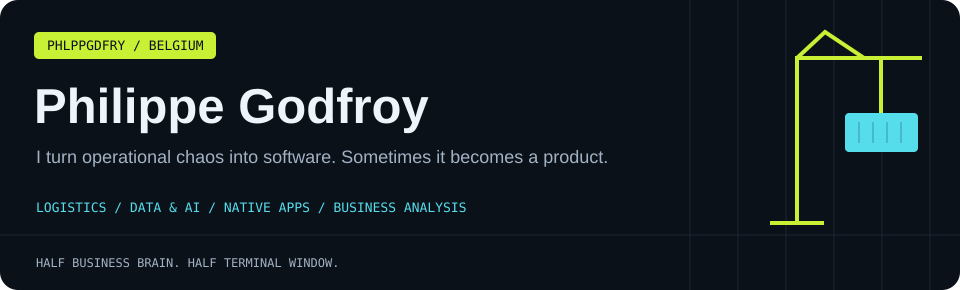
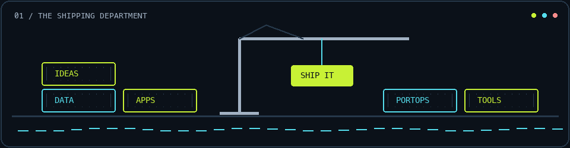
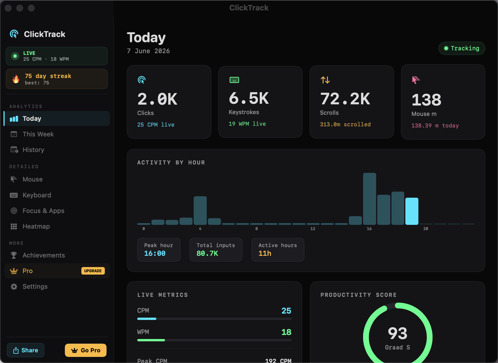
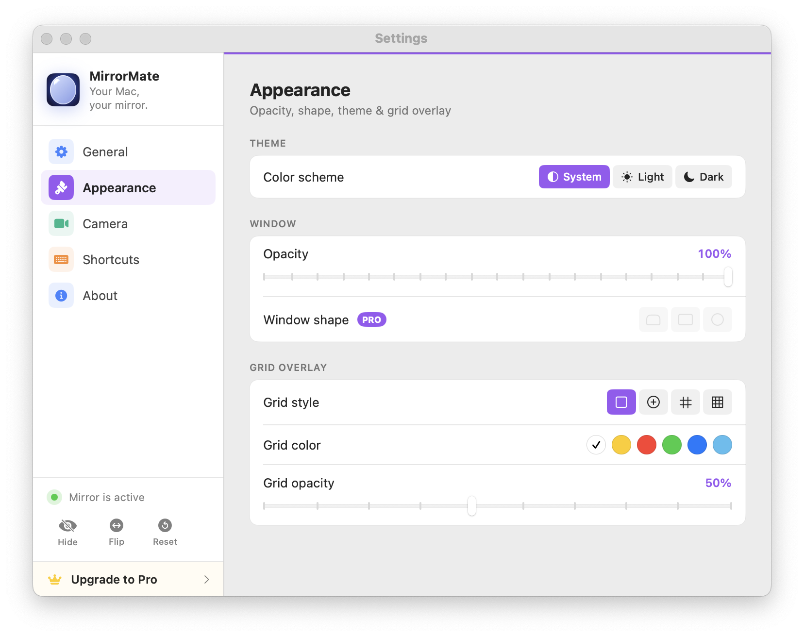
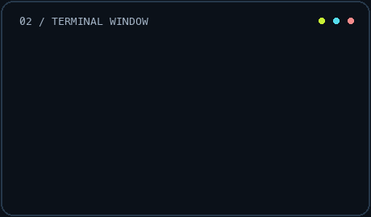
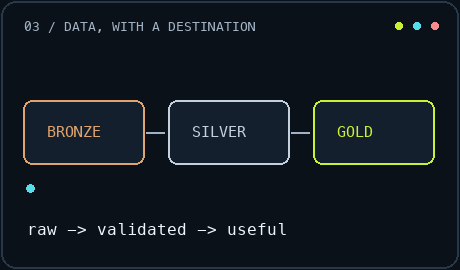
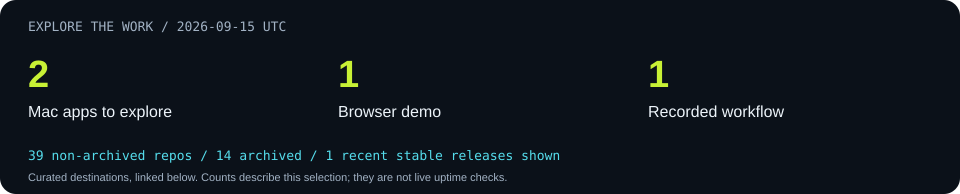
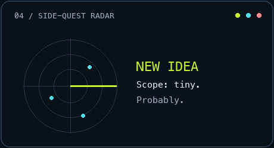
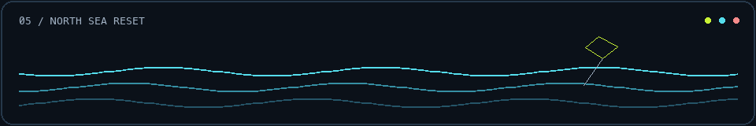

<p align="center">
  
</p>

<p align="center">
  <a href="https://philippegodfroy.com"></a>
  <a href="https://linkedin.com/in/philippe-godfroy"></a>
  <a href="mailto:philippe.godfroy@hotmail.com"></a>
</p>

<p align="center"><b><a href="#start-here">Start here</a> · <a href="#featured-projects">Featured projects</a> · <a href="#project-arcade">Project arcade</a> · <a href="#the-toolbox">Toolbox</a> · <a href="#dispatch-log">Activity</a> · <a href="#off-duty">Off duty</a></b></p>

## Hi, I'm Philippe 👋

A self-taught builder from **Bruges → Knokke-Heist, Belgium**. I like turning vague things into working things: a port operations desk, an offline mobile workflow, a tiny Mac utility, a data pipeline, or a business case with an actual next step.

**Half business brain, half terminal window.** I enjoy the space where software meets operations: understanding the problem, shaping the workflow, building a useful first version, and finding out what breaks.

```yaml
philippe:
  home_base: Belgian coast
  building_since: "~2010"
  interests: [logistics, data, AI, native apps, business analysis]
  default_mode: "understand → prototype → test → improve"
  side_quests: enabled
  scope_creep: investigating
```

## Start here

| If you're here for… | Take this route |
| :--- | :--- |
| 🍎 Apps, product decisions and indie development | [The indie workshop](INDIE_DEV.md) |
| 🧠 Requirements, processes and business cases | [Business analysis portfolio](BA_PROFILE.md) |
| 🛠 Engineering, experience and collaboration | [Professional profile](PROFESSIONAL.md) |
| 🌊 The human behind the repositories | [Off-duty Philippe](PERSONAL.md) |
| 🗂 Everything I've put on the public shelf | [Full project catalog](PROJECTS.md) |

<p align="center"></p>
<p align="center"><sub>Yes, I took “shipping software” literally.</sub></p>

## Featured projects

Six doors into the work. Each repository explains its current scope and how to explore it.

<table>
<tr>
<td width="50%" valign="top">

### 🚢 Logistics Master

**The port and supply-chain portfolio.**

A central hub for terminal simulations, yard capacity, shipment visibility, empty-mileage tools and operational intelligence.

`Portfolio hub` · `Prototypes + research`

**Look inside:** domain modelling, dashboards, APIs and business-analysis case studies.

[Explore the hub →](https://github.com/phlppgdfry/Logistics-Master)

</td>
<td width="50%" valign="top">

### 🧭 PortOps AI

**Which vehicles need attention, and why?**

An operations agent for investigating RoRo readiness, conflicting evidence and booking exceptions, with reviewable action drafts.

`Working local prototype` · `C# / .NET`

**Look inside:** source-backed explanations, scoped tools and human approval. Real-model validation and production integration remain planned.

[Investigate PortOps →](https://github.com/phlppgdfry/portops-ai)

</td>
</tr>
<tr>
<td width="50%" valign="top">

### 🖱 ClickTrack

**A private dashboard for your Mac activity.**

Clicks, keystroke counts, scrolls, focus rhythm and daily patterns — with data kept on your Mac.

<a href="https://github.com/phlppgdfry/ClickTrack"></a>

`macOS app` · `Direct download`

[Project →](https://github.com/phlppgdfry/ClickTrack) · [Downloads →](https://github.com/phlppgdfry/ClickTrack/releases)

</td>
<td width="50%" valign="top">

### 🪞 MirrorMate

**A quick mirror, one shortcut away.**

A native Mac camera utility with a floating mirror, keyboard shortcuts, appearance controls and a focused interface.

<a href="https://github.com/phlppgdfry/MirrorMate-App"></a>

`macOS app` · `SwiftUI / AVFoundation`

[Showcase →](https://github.com/phlppgdfry/MirrorMate-App) · [App Store →](https://apps.apple.com/us/app/mirrormate-menubar-mirror/id6752225278)

</td>
</tr>
<tr>
<td width="50%" valign="top">

### 🏗 Fabric Data Platform

**From raw events to a useful data model.**

A Microsoft Fabric learning project using synthetic lottery-style data to explore Bronze/Silver/Gold layers, PySpark, SQL and dbt.

`Early scaffold / learning lab`

**Look inside:** the architecture, data model and staged build plan. An evolving data-engineering portfolio.

[Follow the build →](https://github.com/phlppgdfry/fabric-lottery-data-platform)

</td>
<td width="50%" valign="top">

### 📱 DocuRelay Field

**Field documentation that survives going offline.**

A .NET MAUI portfolio app with a durable SQLite upload queue, an ASP.NET Core API and a local processing workflow.

`Working portfolio demo` · `.NET MAUI / SQLite`

**Look inside:** verified Android emulator flow, retry handling and the API-to-worker journey.

[Explore the workflow →](https://github.com/phlppgdfry/docurelay-field) · [Watch the demo →](assets/docurelay-demo.gif)

</td>
</tr>
</table>

## On the workbench 🔧

| Focus | What I'm exploring |
| :--- | :--- |
| [PortOps AI](https://github.com/phlppgdfry/portops-ai) | Operational evidence, bounded agent tools and approval workflows |
| [Fabric Data Platform](https://github.com/phlppgdfry/fabric-lottery-data-platform) | Data modelling, Medallion architecture and a staged engineering build |
| [DocuRelay Field](https://github.com/phlppgdfry/docurelay-field) | Offline mobile state, reliable processing and Azure architecture |

<p align="center">
  
  
</p>

## Project arcade

Pick a lane. There are operational tools, native apps, enterprise workflows and a few ideas that escaped the notebook.

| Lane | Good places to start |
| :--- | :--- |
| 🚢 **Ports & logistics** | [Logistics Master](https://github.com/phlppgdfry/Logistics-Master) · [PortOps AI](https://github.com/phlppgdfry/portops-ai) · [PortPulse](https://github.com/phlppgdfry/portpulse) · [TOS simulator](https://github.com/phlppgdfry/terminal-operating-system-sim) |
| 📊 **Data engineering & analytics** | [Fabric platform](https://github.com/phlppgdfry/fabric-lottery-data-platform) · [Sensor data platform](https://github.com/phlppgdfry/environmental-sensor-data-platform) · [Belgium mobility/weather ETL](https://github.com/phlppgdfry/belgium-mobility-weather-etl) · [Sales analytics](https://github.com/phlppgdfry/python-data-analytics-project) |
| 🏢 **Enterprise & .NET** | [Shipment tracking](https://github.com/phlppgdfry/shipment-tracking-platform) · [Business Central operations](https://github.com/phlppgdfry/business-central-agentic-operations) · [DocuRelay](https://github.com/phlppgdfry/docurelay-field) · [Workwear ERP lab](https://github.com/phlppgdfry/workwear-erp-lab) |
| 🍎 **Apps & utilities** | [ClickTrack](https://github.com/phlppgdfry/ClickTrack) · [MirrorMate](https://github.com/phlppgdfry/MirrorMate-App) · [Health intake case study](https://github.com/phlppgdfry/health-intake-pipeline) |
| 🤖 **AI & developer experiments** | [LocalMind](https://github.com/phlppgdfry/LocalMind) · [Foundry lab](https://github.com/phlppgdfry/micro-foundry-lab) · [Git Personality Profiler](https://github.com/phlppgdfry/git-personality-profiler) · [Stack rules](https://github.com/phlppgdfry/stack-rules) |
| 🧠 **Business analysis** | [Breakfast delivery](https://github.com/phlppgdfry/breakfast-delivery-platform) · [Customer churn](https://github.com/phlppgdfry/customer-churn-analysis) · [GymLabb specification](https://github.com/phlppgdfry/gymlabb-platform-spec) |

**[Browse the complete catalog, including labs and archived work →](PROJECTS.md)**

## The toolbox

<p>


</p>

| Work | Tools in context |
| :--- | :--- |
| Native apps | SwiftUI, AVFoundation and StoreKit in [MirrorMate](https://github.com/phlppgdfry/MirrorMate-App) |
| APIs & mobile workflows | ASP.NET Core, MAUI and SQLite in [DocuRelay](https://github.com/phlppgdfry/docurelay-field) |
| Data & reporting | Python, pandas, SQL and Plotly in [Sales Analytics](https://github.com/phlppgdfry/python-data-analytics-project) |
| Operational interfaces | TypeScript dashboards and KPI design in [PortPulse](https://github.com/phlppgdfry/portpulse) |
| Business analysis | Process maps, requirements, user stories and prioritisation in [the BA portfolio](BA_PROFILE.md) |

<details>
<summary><b>More tools, frameworks and things I've experimented with</b></summary>

Web: Next.js, Tailwind CSS, Angular, Node.js, FastAPI, REST APIs and webhooks.

Data: PostgreSQL, Supabase, Firebase, NumPy, Jupyter, Power BI, Excel and Power Query.

AI: Ollama, retrieval, tool calling, model APIs, evaluation and scraping workflows.

Delivery: GitHub Actions, Docker, Vercel, Bicep, Xcode and TestFlight.

Product: BPMN, BRDs, acceptance criteria, MoSCoW, Figma, Jira, Confluence and Miro.

**[Open the full badge wall →](TOOLBOX.md)** · These are tools used or explored; repositories show their actual scope.

</details>

## How I build

**Understand the operation → define the smallest useful workflow → build it → exercise the awkward cases → improve it.**

I'm interested in the details that make a tool usable: what happens offline, where an answer came from, who approves an action, what a KPI actually means, and what a user should do when something fails.

<table>
<tr>
<td width="50%" align="center" valign="top">

<br><sub><b>“I'll just make a quick prototype.”</b></sub>
</td>
<td width="50%" align="center" valign="top">

<br><sub><b>Several repositories later.</b></sub>
</td>
</tr>
</table>

## Dispatch log

<!-- ACTIVITY:START -->


**Recently pushed repositories**

| Repository | Latest push (UTC) |
| :--- | :--- |
| [portops-ai](https://github.com/phlppgdfry/portops-ai) | 2026-09-08 |
| [fabric-lottery-data-platform](https://github.com/phlppgdfry/fabric-lottery-data-platform) | 2026-09-04 |
| [shipment-tracking-platform](https://github.com/phlppgdfry/shipment-tracking-platform) | 2026-09-04 |
| [business-central-agentic-operations](https://github.com/phlppgdfry/business-central-agentic-operations) | 2026-09-04 |
| [Logistics-Master](https://github.com/phlppgdfry/Logistics-Master) | 2026-08-27 |

**Latest stable releases from the featured release watchlist**

- [ClickTrack · v1.0.2](https://github.com/phlppgdfry/ClickTrack/releases/tag/v1.0.2) — 2026-06-07

<sub>Snapshot: 2026-09-09 UTC · Public, owned, non-fork repositories; profile repository excluded. Release watchlist: ClickTrack, MirrorMate, DocuRelay, PortOps, Logistics Master and Shipment Tracking.</sub>
<!-- ACTIVITY:END -->

<sub>Generated from public GitHub data. Repository activity reflects code pushes; releases link to their original notes.</sub>

## Off duty

**Golf, kitesurfing, chess, and a healthy respect for the North Sea wind forecast.** Originally from Bruges, now based in Knokke-Heist. Dutch, French and English.

<p align="center"></p>

<details>
<summary><b>Bonus: the unofficial operating manual</b></summary>

```text
A small idea       → a note
An interesting bug → a late evening
A messy workflow   → a prototype
A windy day        → check the forecast
One more feature   → famous last words
```

[More about the person behind the code →](PERSONAL.md)

</details>

## Let's build something useful

Interested in **operational software, data products, native apps or turning a business problem into a working prototype**? I'd enjoy comparing notes.

**[Website](https://philippegodfroy.com) · [LinkedIn](https://linkedin.com/in/philippe-godfroy) · [Email](mailto:philippe.godfroy@hotmail.com)**

<p align="center"></p>
<p align="center"><sub>Built on the Belgian coast. Usually with a terminal open.<br>Profile exploration inspired by <a href="https://github.com/HariSekhon">Hari Sekhon</a>; harbor artwork and animations made for this profile.</sub></p>
